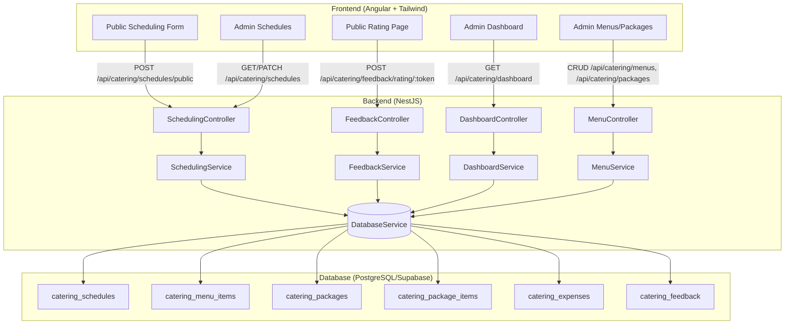

# Design Document: Catering Management Module

## Overview

The Catering Management Module extends the CBIS platform to support STS Catering Services operations. It provides a public-facing scheduling form for customers to book catering events, a customer feedback system (both post-scheduling and post-event via unique rating links), an admin dashboard with operational metrics, schedule lifecycle management (Pending → In-Progress → Completed) with expense tracking, and a full menu/package management system.

The module follows the existing CBIS architecture: NestJS backend modules using the shared `DatabaseService` (pg Pool) for PostgreSQL/Supabase queries, JWT-based authentication via `JwtAuthGuard`, organization-scoped data access, and Angular standalone components with Tailwind CSS on the frontend. Public endpoints (scheduling form, feedback submission, rating links, package listing) bypass authentication, while admin endpoints enforce JWT auth and organization scoping.

### Key Design Decisions

1. **Single NestJS module with multiple controllers** — Rather than creating four separate NestJS modules (scheduling, menu, dashboard, feedback), we use a single `CateringModule` with dedicated controllers and services. This keeps the module cohesive while maintaining separation of concerns internally.

2. **Direct SQL via DatabaseService** — Consistent with the existing codebase pattern (no ORM). All queries use parameterized SQL through the shared `DatabaseService`.

3. **UUID-based rating link tokens** — Rating links use cryptographically random tokens (UUID v4) stored in the feedback table, providing uniqueness without sequential guessing.

4. **Organization scoping via JWT claims** — Admin endpoints extract `orgId` from the JWT token (same pattern as `job-orders`). Public endpoints for the scheduling form use a known organization identifier for STS Catering Services.

5. **Expense categories as CHECK constraint** — Rather than a separate lookup table, expense categories are enforced via a PostgreSQL CHECK constraint, matching the pattern used for schedule status and menu categories.

## Architecture



### Request Flow

1. **Public scheduling**: Customer submits form → `POST /api/catering/schedules/public` (no auth) → validates input → creates schedule with Pending status → returns confirmation
2. **Scheduling feedback**: Customer submits feedback → `POST /api/catering/feedback/scheduling/:scheduleId` (no auth) → validates → stores feedback
3. **Rating link flow**: Admin generates link → `POST /api/catering/feedback/generate-link/:scheduleId` (auth) → returns URL → Customer accesses `GET /api/catering/feedback/rating/:token` → submits rating → `POST /api/catering/feedback/rating/:token` (no auth)
4. **Schedule lifecycle**: Admin confirms (`PATCH /api/catering/schedules/:id/confirm`) → Admin completes with expenses (`PATCH /api/catering/schedules/:id/complete`)
5. **Menu/Package CRUD**: Standard authenticated CRUD operations scoped to organization

## Components and Interfaces

### Backend Module Structure

```
backend/src/catering/
├── catering.module.ts
├── controllers/
│   ├── scheduling.controller.ts
│   ├── feedback.controller.ts
│   ├── dashboard.controller.ts
│   └── menu.controller.ts
├── services/
│   ├── scheduling.service.ts
│   ├── feedback.service.ts
│   ├── dashboard.service.ts
│   └── menu.service.ts
└── dto/
    ├── create-schedule.dto.ts
    ├── create-feedback.dto.ts
    ├── create-menu-item.dto.ts
    ├── create-package.dto.ts
    └── complete-schedule.dto.ts
```

### API Endpoints

#### Scheduling Controller (`/api/catering/schedules`)

| Method | Path | Auth | Description |
|--------|------|------|-------------|
| POST | `/public` | No | Submit public scheduling request |
| GET | `/` | Yes | List schedules with status filter |
| PATCH | `/:id/confirm` | Yes | Confirm pending schedule |
| PATCH | `/:id/complete` | Yes | Complete schedule with expenses |

#### Feedback Controller (`/api/catering/feedback`)

| Method | Path | Auth | Description |
|--------|------|------|-------------|
| POST | `/scheduling/:scheduleId` | No | Submit scheduling experience feedback |
| POST | `/generate-link/:scheduleId` | Yes | Generate rating link for completed schedule |
| GET | `/rating/:token` | No | Get rating page data (validate token) |
| POST | `/rating/:token` | No | Submit satisfaction rating via link |

#### Dashboard Controller (`/api/catering/dashboard`)

| Method | Path | Auth | Description |
|--------|------|------|-------------|
| GET | `/metrics` | Yes | Get dashboard metric cards |
| GET | `/feedback` | Yes | Get paginated feedback list |

#### Menu Controller (`/api/catering/menus`)

| Method | Path | Auth | Description |
|--------|------|------|-------------|
| GET | `/items` | Yes | List menu items grouped by category |
| POST | `/items` | Yes | Create menu item |
| PATCH | `/items/:id` | Yes | Update menu item |
| DELETE | `/items/:id` | Yes | Delete menu item |
| GET | `/packages` | Yes | List packages |
| GET | `/packages/public/:orgId` | No | List packages (public, for scheduling form) |
| POST | `/packages` | Yes | Create package |
| PATCH | `/packages/:id` | Yes | Update package |
| DELETE | `/packages/:id` | Yes | Delete package |

### Frontend Component Structure

```
frontend/src/app/pages/catering/
├── public/
│   ├── scheduling-form/
│   │   └── scheduling-form.component.ts
│   └── rating-page/
│       └── rating-page.component.ts
├── dashboard/
│   └── catering-dashboard.component.ts
├── schedules/
│   └── catering-schedules.component.ts
└── menus/
    └── catering-menus.component.ts
```

### Service Interfaces

```typescript
// SchedulingService
interface SchedulingService {
  createPublicSchedule(dto: CreateScheduleDto): Promise<{ success: boolean; data?: Schedule; message?: string }>;
  findAll(orgId: number, status: ScheduleStatus): Promise<{ success: boolean; data: Schedule[] }>;
  confirm(id: number, orgId: number): Promise<{ success: boolean; data?: Schedule; message?: string }>;
  complete(id: number, orgId: number, expenses: ExpenseEntry[]): Promise<{ success: boolean; message?: string }>;
}

// FeedbackService
interface FeedbackService {
  submitSchedulingFeedback(scheduleId: number, dto: CreateFeedbackDto): Promise<{ success: boolean; message?: string }>;
  generateRatingLink(scheduleId: number, orgId: number): Promise<{ success: boolean; data?: { url: string }; message?: string }>;
  validateRatingLink(token: string): Promise<{ success: boolean; data?: { scheduleId: number }; message?: string }>;
  submitRating(token: string, dto: CreateFeedbackDto): Promise<{ success: boolean; message?: string }>;
}

// DashboardService
interface DashboardService {
  getMetrics(orgId: number): Promise<{ success: boolean; data: DashboardMetrics }>;
  getFeedbackList(orgId: number, page: number): Promise<{ success: boolean; data: FeedbackListResponse }>;
}

// MenuService
interface MenuService {
  createMenuItem(orgId: number, dto: CreateMenuItemDto): Promise<{ success: boolean; data?: MenuItem; message?: string }>;
  listMenuItems(orgId: number): Promise<{ success: boolean; data: GroupedMenuItems }>;
  updateMenuItem(id: number, orgId: number, dto: Partial<CreateMenuItemDto>): Promise<{ success: boolean; message?: string }>;
  deleteMenuItem(id: number, orgId: number): Promise<{ success: boolean; message?: string }>;
  createPackage(orgId: number, dto: CreatePackageDto): Promise<{ success: boolean; data?: Package; message?: string }>;
  listPackages(orgId: number): Promise<{ success: boolean; data: Package[] }>;
  listPackagesPublic(orgId: number): Promise<{ success: boolean; data: Package[] }>;
  updatePackage(id: number, orgId: number, dto: Partial<CreatePackageDto>): Promise<{ success: boolean; message?: string }>;
  deletePackage(id: number, orgId: number): Promise<{ success: boolean; message?: string }>;
}
```

## Data Models

### Database Tables

```sql
-- Catering Schedules
CREATE TABLE catering_schedules (
  id BIGSERIAL PRIMARY KEY,
  org_id BIGINT NOT NULL REFERENCES organizations(id),
  customer_name VARCHAR(100) NOT NULL,
  contact_number VARCHAR(50) NOT NULL,
  venue TEXT NOT NULL,
  event_date DATE NOT NULL,
  pax INTEGER NOT NULL CHECK (pax >= 1),
  package_id BIGINT NOT NULL REFERENCES catering_packages(id) ON DELETE RESTRICT,
  status VARCHAR(20) NOT NULL DEFAULT 'pending'
    CHECK (status IN ('pending', 'in_progress', 'completed')),
  total_expense NUMERIC(12,2) DEFAULT 0.00,
  created_at TIMESTAMPTZ DEFAULT NOW(),
  updated_at TIMESTAMPTZ
);

CREATE INDEX idx_catering_schedules_org ON catering_schedules(org_id);
CREATE INDEX idx_catering_schedules_status ON catering_schedules(org_id, status);

-- Catering Menu Items
CREATE TABLE catering_menu_items (
  id BIGSERIAL PRIMARY KEY,
  org_id BIGINT NOT NULL REFERENCES organizations(id),
  name VARCHAR(100) NOT NULL,
  category VARCHAR(20) NOT NULL
    CHECK (category IN ('chicken', 'pork', 'vegetable', 'seafood', 'beef',
                        'soup', 'pasta', 'salad', 'drinks', 'dessert',
                        'appetizer', 'freebie')),
  created_at TIMESTAMPTZ DEFAULT NOW(),
  updated_at TIMESTAMPTZ
);

CREATE INDEX idx_catering_menu_items_org ON catering_menu_items(org_id);

-- Catering Packages
CREATE TABLE catering_packages (
  id BIGSERIAL PRIMARY KEY,
  org_id BIGINT NOT NULL REFERENCES organizations(id),
  name VARCHAR(100) NOT NULL,
  price_per_head NUMERIC(12,2) NOT NULL CHECK (price_per_head > 0),
  min_pax INTEGER NOT NULL CHECK (min_pax >= 1),
  created_at TIMESTAMPTZ DEFAULT NOW(),
  updated_at TIMESTAMPTZ
);

CREATE INDEX idx_catering_packages_org ON catering_packages(org_id);

-- Package-Menu Item Junction
CREATE TABLE catering_package_items (
  package_id BIGINT NOT NULL REFERENCES catering_packages(id) ON DELETE CASCADE,
  menu_item_id BIGINT NOT NULL REFERENCES catering_menu_items(id) ON DELETE CASCADE,
  selection_limit INTEGER NOT NULL CHECK (selection_limit >= 1),
  UNIQUE (package_id, menu_item_id)
);

-- Catering Expenses
CREATE TABLE catering_expenses (
  id BIGSERIAL PRIMARY KEY,
  schedule_id BIGINT NOT NULL REFERENCES catering_schedules(id) ON DELETE CASCADE,
  category VARCHAR(50) NOT NULL
    CHECK (category IN ('Purchases', 'Rental', 'Electricity & Water',
                        'Communication', 'Salaries & Wages', 'Supplies & Materials',
                        'Repair & Maintenance', 'Travel & Transportation',
                        'Representation', 'SSS', 'Philhealth', 'Pag IBIG',
                        'Taxes', 'Licenses', 'Professional Fee', 'Miscellaneous')),
  amount NUMERIC(12,2) NOT NULL CHECK (amount >= 0),
  created_at TIMESTAMPTZ DEFAULT NOW(),
  updated_at TIMESTAMPTZ
);

CREATE INDEX idx_catering_expenses_schedule ON catering_expenses(schedule_id);

-- Catering Feedback
CREATE TABLE catering_feedback (
  id BIGSERIAL PRIMARY KEY,
  schedule_id BIGINT NOT NULL REFERENCES catering_schedules(id) ON DELETE CASCADE,
  feedback_type VARCHAR(30) NOT NULL
    CHECK (feedback_type IN ('scheduling_experience', 'satisfaction_rating')),
  rating INTEGER NOT NULL CHECK (rating >= 1 AND rating <= 5),
  review TEXT,
  link_token VARCHAR(64) UNIQUE,
  link_expires_at TIMESTAMPTZ,
  created_at TIMESTAMPTZ DEFAULT NOW()
);

CREATE INDEX idx_catering_feedback_schedule ON catering_feedback(schedule_id);
CREATE INDEX idx_catering_feedback_token ON catering_feedback(link_token) WHERE link_token IS NOT NULL;
```

### TypeScript Interfaces

```typescript
type ScheduleStatus = 'pending' | 'in_progress' | 'completed';

type MenuCategory = 'chicken' | 'pork' | 'vegetable' | 'seafood' | 'beef' |
  'soup' | 'pasta' | 'salad' | 'drinks' | 'dessert' | 'appetizer' | 'freebie';

type ExpenseCategory = 'Purchases' | 'Rental' | 'Electricity & Water' |
  'Communication' | 'Salaries & Wages' | 'Supplies & Materials' |
  'Repair & Maintenance' | 'Travel & Transportation' | 'Representation' |
  'SSS' | 'Philhealth' | 'Pag IBIG' | 'Taxes' | 'Licenses' |
  'Professional Fee' | 'Miscellaneous';

type FeedbackType = 'scheduling_experience' | 'satisfaction_rating';

interface Schedule {
  id: number;
  orgId: number;
  customerName: string;
  contactNumber: string;
  venue: string;
  eventDate: string; // ISO date
  pax: number;
  packageId: number;
  packageName?: string;
  status: ScheduleStatus;
  totalExpense: number;
  createdAt: string;
  updatedAt: string | null;
}

interface MenuItem {
  id: number;
  orgId: number;
  name: string;
  category: MenuCategory;
  createdAt: string;
  updatedAt: string | null;
}

interface Package {
  id: number;
  orgId: number;
  name: string;
  pricePerHead: number;
  minPax: number;
  items: PackageItem[];
  createdAt: string;
  updatedAt: string | null;
}

interface PackageItem {
  menuItemId: number;
  menuItemName: string;
  category: MenuCategory;
  selectionLimit: number;
}

interface ExpenseEntry {
  category: ExpenseCategory;
  amount: number;
}

interface DashboardMetrics {
  pendingCount: number;
  inProgressCount: number;
  totalSales: number;    // sum of (pax * price_per_head) for completed
  totalExpenses: number; // sum of all expenses for completed
}

interface FeedbackRecord {
  id: number;
  customerName: string;
  rating: number;
  review: string | null;
  feedbackType: FeedbackType;
  submittedAt: string;
  eventDate: string;
}

interface FeedbackListResponse {
  items: FeedbackRecord[];
  averageRating: number;
  total: number;
  page: number;
  pageSize: number;
}

// DTOs
interface CreateScheduleDto {
  customerName: string;    // max 100 chars
  contactNumber: string;   // max 15 chars, digits only
  venue: string;           // max 200 chars
  eventDate: string;       // future date, ISO format
  pax: number;             // >= 1, >= package min_pax
  packageId: number;       // valid package ID
}

interface CreateFeedbackDto {
  rating: number;          // integer 1-5
  comment?: string;        // max 500 chars (scheduling) or 1000 chars (satisfaction)
}

interface CreateMenuItemDto {
  name: string;            // max 100 chars
  category: MenuCategory;
}

interface CreatePackageDto {
  name: string;                    // max 100 chars
  pricePerHead: number;            // 0.01 - 999,999,999.99
  minPax: number;                  // 1 - 10,000
  items: {
    menuItemId: number;
    selectionLimit: number;        // >= 1, <= items in that category
  }[];
}

interface CompleteScheduleDto {
  expenses: ExpenseEntry[];        // each amount 0.00 - 999,999,999.99
}
```


## Correctness Properties

*A property is a characteristic or behavior that should hold true across all valid executions of a system — essentially, a formal statement about what the system should do. Properties serve as the bridge between human-readable specifications and machine-verifiable correctness guarantees.*

### Property 1: Valid scheduling request creates a Pending schedule

*For any* valid scheduling request (customer name ≤ 100 chars, contact number ≤ 15 digits-only chars, venue ≤ 200 chars, future event date, pax ≥ 1 and ≥ package minimum, valid package ID), the system SHALL create a new Schedule with status "pending" associated with the STS Catering Services organization.

**Validates: Requirements 1.2, 1.3, 1.10**

### Property 2: Invalid scheduling input is rejected with descriptive error

*For any* scheduling request where at least one field violates its constraint (missing required field, customer name > 100 chars, contact number > 15 chars or containing non-digits, venue > 200 chars, past event date, pax < 1, pax < package minimum, or invalid package ID), the system SHALL reject the request and return a validation error identifying the violated constraint.

**Validates: Requirements 1.5, 1.6, 1.7, 1.8, 1.9, 1.11, 1.12, 1.13**

### Property 3: Feedback rating validation

*For any* integer value between 1 and 5 inclusive, the feedback system SHALL accept it as a valid rating. *For any* value outside that range or any non-integer value, the system SHALL reject it with a validation error.

**Validates: Requirements 3.2, 3.3, 4.11**

### Property 4: Scheduling feedback is idempotent (single submission per schedule)

*For any* Schedule that already has scheduling experience feedback recorded, a subsequent feedback submission for the same Schedule SHALL be rejected with an error indicating feedback has already been submitted.

**Validates: Requirements 3.6**

### Property 5: Rating link generation requires Completed status

*For any* Schedule with status "completed", generating a rating link SHALL succeed and produce a unique token with a 30-day expiration. *For any* Schedule with status "pending" or "in_progress", generating a rating link SHALL fail with an error.

**Validates: Requirements 4.1, 4.2, 4.10**

### Property 6: Rating link single-use and expiration enforcement

*For any* valid, unused, non-expired rating link token, feedback submission SHALL succeed. *For any* token that has already been used, or any token that has expired (> 30 days), or any invalid/non-existent token, feedback submission SHALL fail with an appropriate error message.

**Validates: Requirements 4.3, 4.4, 4.5, 4.6**

### Property 7: Dashboard metrics are consistent with underlying data

*For any* set of Schedules belonging to an organization, the dashboard metrics SHALL satisfy: `pendingCount` equals the count of schedules with status "pending", `inProgressCount` equals the count with status "in_progress", `totalSales` equals the sum of (pax × price_per_head) for all completed schedules rounded to 2 decimal places, and `totalExpenses` equals the sum of all expense amounts for completed schedules rounded to 2 decimal places.

**Validates: Requirements 5.1, 5.2, 5.3, 5.4**

### Property 8: Schedule status filtering returns correct subset in correct order

*For any* set of Schedules belonging to an organization and any status filter value, the returned list SHALL contain only schedules matching that status. Pending and In-Progress lists SHALL be ordered by event date ascending; Completed lists SHALL be ordered by event date descending.

**Validates: Requirements 7.1, 7.2, 7.3**

### Property 9: Schedule state machine transitions

*For any* Schedule in "pending" status, confirming SHALL transition it to "in_progress". *For any* Schedule in "in_progress" status, completing SHALL transition it to "completed". *For any* Schedule not in the required source status, the transition SHALL be rejected with an error.

**Validates: Requirements 8.1, 8.2, 9.1, 9.5**

### Property 10: Expense storage round-trip and total calculation

*For any* set of expense entries (each with a valid category and amount between 0.00 and 999,999,999.99), when submitted during schedule completion, each expense SHALL be stored with its category and amount, and the schedule's total expense SHALL equal the sum of all submitted amounts.

**Validates: Requirements 9.2, 9.3, 9.4, 9.7**

### Property 11: Menu item category validation

*For any* string that is one of the 12 valid menu categories, menu item creation SHALL succeed. *For any* string not in the valid set, creation SHALL fail with a validation error listing valid categories.

**Validates: Requirements 10.2, 10.3**

### Property 12: Menu items grouped by category

*For any* set of menu items belonging to an organization, the list endpoint SHALL return them grouped by their category, with every item appearing exactly once in its correct group.

**Validates: Requirements 10.4**

### Property 13: Menu item deletion constraint

*For any* menu item that is referenced by at least one active Package, deletion SHALL be rejected with an error. *For any* menu item not referenced by any Package, deletion SHALL succeed and the item SHALL no longer appear in subsequent queries.

**Validates: Requirements 10.6, 10.8**

### Property 14: Package creation round-trip

*For any* valid package (name ≤ 100 chars non-empty, price_per_head between 0.01 and 999,999,999.99, min_pax between 1 and 10,000, at least one valid menu item, selection limits ≥ 1 and ≤ items count per category), creating and then retrieving the package SHALL return all submitted data unchanged.

**Validates: Requirements 11.1, 11.2, 11.3, 11.4, 11.5**

### Property 15: Package deletion constraint

*For any* Package referenced by at least one Schedule with status "pending" or "in_progress", deletion SHALL be rejected. *For any* Package not referenced by any active Schedule, deletion SHALL succeed.

**Validates: Requirements 11.7, 11.10**

### Property 16: Organization data isolation

*For any* resource (schedule, menu item, package, feedback) belonging to organization A, a request authenticated as organization B SHALL receive a not-found response, never revealing the resource exists.

**Validates: Requirements 15.1, 15.2, 15.3, 15.4, 15.5**

### Property 17: Feedback list pagination and ordering

*For any* set of feedback records belonging to an organization, the feedback list SHALL be ordered by submission date descending, limited to 50 records per page, and the average rating SHALL equal the arithmetic mean of all ratings rounded to one decimal place.

**Validates: Requirements 6.1, 6.2, 6.3, 6.5**

## Error Handling

### Backend Error Strategy

All services follow the existing CBIS pattern of returning `{ success: boolean; message?: string; data?: T }` response objects. Errors are categorized as:

| Error Type | HTTP Status | Pattern |
|-----------|-------------|---------|
| Validation Error | 400 | Missing/invalid fields with descriptive message |
| Not Found | 404 | Resource doesn't exist or belongs to different org |
| Conflict | 409 | Duplicate feedback, invalid state transition |
| Server Error | 500 | Unexpected database or runtime errors |

### Validation Approach

- **DTOs with class-validator**: Use `class-validator` decorators for input validation on all DTOs (consistent with existing project dependencies)
- **Custom validation pipe**: Apply NestJS `ValidationPipe` on catering controllers
- **Database constraints as safety net**: CHECK constraints on status, category, and amount columns provide a second layer of validation

### Specific Error Scenarios

1. **Schedule creation**: Return field-specific error messages (e.g., "Customer name must not exceed 100 characters")
2. **State transitions**: Return status-aware messages (e.g., "Only pending schedules can be confirmed")
3. **Rating links**: Distinguish between expired, used, and invalid tokens in error messages
4. **Deletion constraints**: Explain why deletion is blocked (e.g., "Menu item cannot be deleted while referenced by package 'Premium Package'")
5. **Organization isolation**: Always return 404 (not 403) for cross-org access to avoid information leakage

### Frontend Error Handling

- Display server-returned error messages directly to the user
- On network failures, show generic "Could not complete request" message and preserve form state
- Provide retry buttons on dashboard data fetch failures
- Disable form submission when package list fails to load

## Testing Strategy

### Property-Based Testing

This feature is well-suited for property-based testing because it contains significant pure business logic (validation, state transitions, metric calculations, data transformations) that can be tested with generated inputs.

**Library**: [fast-check](https://github.com/dubzzz/fast-check) for TypeScript/Jest

**Configuration**: Minimum 100 iterations per property test

**Tag format**: `Feature: catering-management, Property {number}: {property_text}`

### Test Categories

#### Property-Based Tests (Services Layer)

Each correctness property (1–17) maps to one or more property-based tests targeting the service layer with a mocked `DatabaseService`:

- **Scheduling validation** (Properties 1, 2): Generate random valid/invalid DTOs, verify acceptance/rejection
- **Feedback validation** (Properties 3, 4): Generate random ratings and schedule states
- **Rating links** (Properties 5, 6): Generate random schedules in various states, test link lifecycle
- **Dashboard metrics** (Property 7): Generate random schedule/expense datasets, verify computed metrics
- **Status filtering** (Property 8): Generate random schedule sets, verify filter correctness
- **State machine** (Property 9): Generate random schedules in each state, verify transitions
- **Expense round-trip** (Property 10): Generate random expense sets, verify storage and totals
- **Menu/Package validation** (Properties 11–15): Generate random menu items and packages
- **Org isolation** (Property 16): Generate cross-org access attempts
- **Feedback pagination** (Property 17): Generate random feedback sets, verify ordering and averages

#### Unit Tests (Example-Based)

- Confirmation message format after successful scheduling
- Empty state responses (zero metrics, empty feedback list)
- Specific UI component rendering (form fields, buttons, tabs)
- Error message formatting

#### Integration Tests

- Full request lifecycle: create schedule → submit feedback → generate link → submit rating
- Database constraint enforcement (foreign keys, CHECK constraints)
- JWT authentication and guard behavior
- Public vs. authenticated endpoint access

#### E2E Tests

- Complete scheduling flow from form submission to completion with expenses
- Rating link email-to-submission flow
- Dashboard data accuracy after multiple operations

### Test File Structure

```
backend/src/catering/
├── __tests__/
│   ├── scheduling.service.spec.ts
│   ├── scheduling.service.property.spec.ts
│   ├── feedback.service.spec.ts
│   ├── feedback.service.property.spec.ts
│   ├── dashboard.service.spec.ts
│   ├── dashboard.service.property.spec.ts
│   ├── menu.service.spec.ts
│   └── menu.service.property.spec.ts
```
