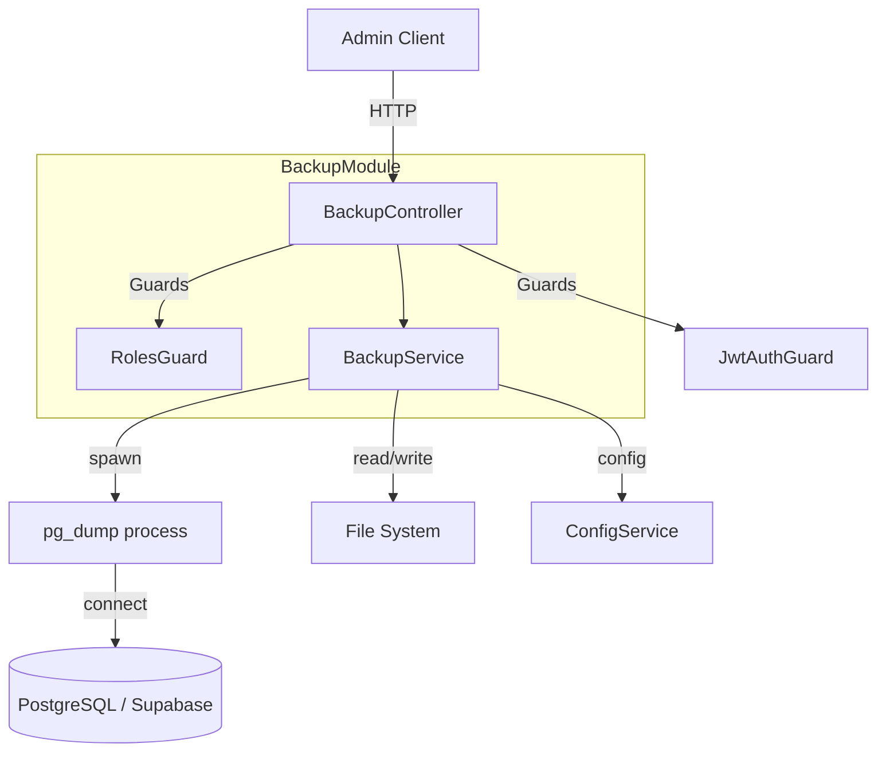
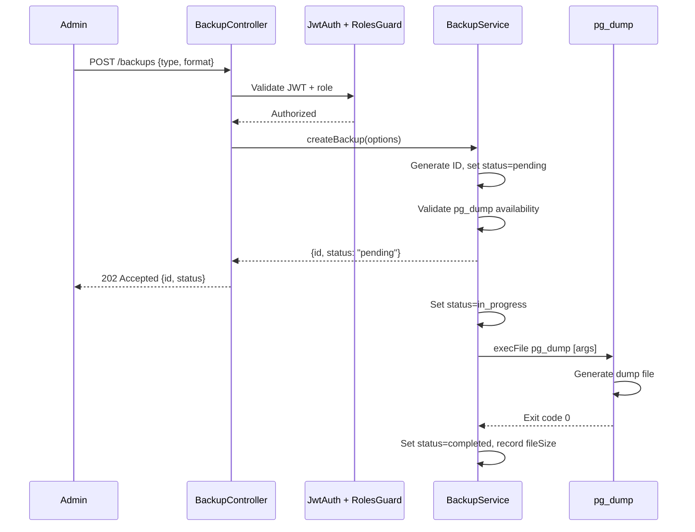
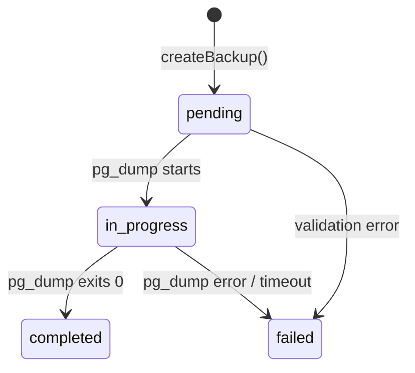

# Design Document: Database Backup & Migration

## Overview

This feature adds a database backup and export module to the STS Car Expert NestJS backend. It enables administrators to create portable PostgreSQL backup files using `pg_dump`, download them via streaming, and manage backup lifecycle (list, status check, delete). The module integrates with the existing authentication system (JWT + role-based guards) and database configuration.

The backup module is implemented as a standalone NestJS module (`BackupModule`) following the same patterns as existing modules (e.g., `InventoryModule`, `ReportsModule`). It spawns `pg_dump` as a child process, tracks backup metadata in-memory (with optional persistence), and stores generated files on the local filesystem.

### Key Design Decisions

1. **Child process execution**: `pg_dump` is spawned via Node.js `child_process.execFile` to avoid shell injection risks and provide timeout control.
2. **In-memory metadata store**: Backup metadata is stored in a `Map<string, BackupMetadata>` within the service. This keeps the feature self-contained without requiring additional database tables. Metadata is lost on server restart (acceptable for a backup utility).
3. **File streaming for downloads**: Large backup files are streamed using `fs.createReadStream` to avoid loading entire files into memory.
4. **Role guard composition**: A new `RolesGuard` is composed with the existing `JwtAuthGuard` to enforce admin/superadmin access.

## Architecture



### Request Flow



## Components and Interfaces

### BackupModule

Registers the controller, service, and imports `ConfigModule`.

```typescript
@Module({
  imports: [ConfigModule],
  controllers: [BackupController],
  providers: [BackupService],
})
export class BackupModule {}
```

### BackupController

| Endpoint | Method | Description | Auth |
|----------|--------|-------------|------|
| `/backups` | POST | Trigger a new backup | admin, superadmin |
| `/backups` | GET | List all backups | admin, superadmin |
| `/backups/:id` | GET | Get backup status/metadata | admin, superadmin |
| `/backups/:id/download` | GET | Download backup file | admin, superadmin |
| `/backups/:id` | DELETE | Delete a backup | admin, superadmin |

### BackupService

Core methods:

| Method | Signature | Description |
|--------|-----------|-------------|
| `createBackup` | `(options: CreateBackupDto) => Promise<BackupMetadata>` | Initiates backup, returns metadata immediately |
| `getBackup` | `(id: string) => BackupMetadata \| undefined` | Returns metadata for a single backup |
| `listBackups` | `() => BackupMetadata[]` | Returns all backups sorted by creation date desc |
| `deleteBackup` | `(id: string) => Promise<void>` | Removes file and metadata |
| `getBackupFilePath` | `(id: string) => string \| null` | Returns absolute file path if completed |
| `buildPgDumpArgs` | `(options: CreateBackupDto) => string[]` | Constructs pg_dump CLI arguments |

### RolesGuard

A new `CanActivate` guard that checks `request.user.roleName` against allowed roles.

```typescript
@Injectable()
export class RolesGuard implements CanActivate {
  constructor(private reflector: Reflector) {}

  canActivate(context: ExecutionContext): boolean {
    const requiredRoles = this.reflector.get<string[]>('roles', context.getHandler())
      ?? this.reflector.get<string[]>('roles', context.getClass());
    if (!requiredRoles) return true;
    const request = context.switchToHttp().getRequest();
    const userRole = request.user?.roleName;
    return requiredRoles.includes(userRole);
  }
}
```

### DTOs

```typescript
// CreateBackupDto
export class CreateBackupDto {
  @IsOptional()
  @IsIn(['full', 'schema-only', 'data-only'])
  type?: 'full' | 'schema-only' | 'data-only'; // default: 'full'

  @IsOptional()
  @IsIn(['plain', 'custom'])
  format?: 'plain' | 'custom'; // default: 'plain'
}
```

### Interfaces

```typescript
export interface BackupMetadata {
  id: string;                          // UUID v4
  status: 'pending' | 'in_progress' | 'completed' | 'failed';
  type: 'full' | 'schema-only' | 'data-only';
  format: 'plain' | 'custom';
  databaseName: string;
  createdAt: string;                   // ISO 8601
  completedAt?: string;                // ISO 8601
  fileSizeBytes?: number;
  fileName?: string;
  errorMessage?: string;
  downloadUrl?: string;
}
```

## Data Models

### BackupMetadata (In-Memory Store)

| Field | Type | Description |
|-------|------|-------------|
| `id` | `string` (UUID v4) | Unique backup identifier |
| `status` | `enum` | pending → in_progress → completed \| failed |
| `type` | `enum` | full, schema-only, data-only |
| `format` | `enum` | plain (.sql), custom (.dump) |
| `databaseName` | `string` | Name of the backed-up database |
| `createdAt` | `string` (ISO 8601) | When backup was initiated |
| `completedAt` | `string` (ISO 8601) | When backup finished (success or failure) |
| `fileSizeBytes` | `number` | Size of the generated file |
| `fileName` | `string` | File name on disk following naming convention |
| `errorMessage` | `string` | Error details if status is "failed" |
| `downloadUrl` | `string` | Relative URL for downloading the file |

### File Naming Convention

Pattern: `{databaseName}_{backupType}_{timestamp}.{extension}`

- `timestamp`: `YYYYMMDDTHHmmss` (ISO 8601 basic, no separators)
- `backupType`: `full`, `schema`, or `data`
- `extension`: `sql` (plain format) or `dump` (custom archive format)

Example: `sts_car_expert_full_20250115T143022.sql`

### State Machine



### Configuration

| Environment Variable | Default | Description |
|---------------------|---------|-------------|
| `BACKUP_STORAGE_PATH` | `./backups` | Directory for storing backup files |
| `DATABASE_URL` | — | PostgreSQL connection string (existing) |
| `DB_HOST` | `127.0.0.1` | Database host (fallback) |
| `DB_PORT` | `5432` | Database port (fallback) |
| `DB_NAME` | `postgres` | Database name (fallback) |
| `DB_USER` | `postgres` | Database user (fallback) |
| `DB_PASSWORD` | — | Database password (fallback) |

### Excluded Schemas

The following Supabase-internal schemas are excluded from all backups via `--exclude-schema` flags:

- `auth`
- `storage`
- `realtime`
- `extensions`
- `supabase_functions`
- `supabase_migrations`
- `pgsodium`
- `vault`
- `graphql`
- `graphql_public`

## Correctness Properties

*A property is a characteristic or behavior that should hold true across all valid executions of a system—essentially, a formal statement about what the system should do. Properties serve as the bridge between human-readable specifications and machine-verifiable correctness guarantees.*

### Property 1: pg_dump argument correctness

*For any* valid backup configuration (any combination of backup type and format), the `buildPgDumpArgs` function SHALL produce arguments that include the correct type flag (`--schema-only` for schema-only, `--data-only` for data-only, neither for full), the correct format flag (`-Fp` for plain, `-Fc` for custom), UTF-8 encoding (`--encoding=UTF8`), and all 10 required `--exclude-schema` flags for Supabase-internal schemas.

**Validates: Requirements 1.2, 2.5, 2.6**

### Property 2: Invalid backup type rejection

*For any* string that is not one of "full", "schema-only", or "data-only", the backup creation validation SHALL reject the request and return an error listing the accepted values.

**Validates: Requirements 1.4**

### Property 3: Content-Type mapping

*For any* backup with a known format (plain or custom), the download response SHALL set Content-Type to "application/sql" for plain format (.sql files) and "application/octet-stream" for custom format (.dump files).

**Validates: Requirements 3.2**

### Property 4: Filename generation pattern

*For any* valid database name, backup type, and timestamp, the generated filename SHALL match the pattern `{databaseName}_{backupType}_{YYYYMMDDTHHmmss}.{extension}` where backupType is "full", "schema", or "data", and extension is "sql" for plain format or "dump" for custom format.

**Validates: Requirements 3.3, 5.4**

### Property 5: Non-completed status blocks download

*For any* backup whose status is "pending", "in_progress", or "failed", a download request SHALL be rejected with a 409 Conflict response indicating the current status.

**Validates: Requirements 3.5**

### Property 6: List sorting invariant

*For any* collection of backups with varying creation timestamps, the list endpoint SHALL return them sorted by `createdAt` in descending order (most recent first), such that for every consecutive pair (i, i+1), `backups[i].createdAt >= backups[i+1].createdAt`.

**Validates: Requirements 4.1**

### Property 7: Metadata completeness

*For any* backup metadata object returned by the service, it SHALL contain all required fields: id (non-empty string), createdAt (valid ISO 8601 timestamp), type (valid backup type), format (valid format), and databaseName (non-empty string).

**Validates: Requirements 4.2**

### Property 8: Active backup blocks deletion

*For any* backup whose status is "pending" or "in_progress", a DELETE request SHALL be rejected with a 409 Conflict response indicating the backup cannot be deleted while active.

**Validates: Requirements 4.5**

### Property 9: Role-based access control

*For any* authenticated user whose `roleName` is not "admin" and not "superadmin", all backup endpoint requests SHALL be rejected with a 403 Forbidden response.

**Validates: Requirements 6.2, 6.5**

### Property 10: Status validity invariant

*For any* backup at any point in its lifecycle, the status field SHALL always be exactly one of: "pending", "in_progress", "completed", or "failed".

**Validates: Requirements 7.2**

### Property 11: Status-dependent response fields

*For any* backup with status "completed", the response SHALL include `fileSizeBytes` (positive number) and `downloadUrl` (non-empty string). *For any* backup with status "failed", the response SHALL include `errorMessage` (non-empty string).

**Validates: Requirements 7.4, 7.5**

## Error Handling

### Error Categories

| Category | HTTP Status | Condition |
|----------|-------------|-----------|
| Authentication failure | 401 | Missing, malformed, or expired JWT |
| Authorization failure | 403 | Valid JWT but insufficient role |
| Not found | 404 | Backup ID doesn't exist, or file missing from disk |
| Conflict | 409 | Download attempted on non-completed backup, or delete on active backup |
| Validation error | 400 | Invalid backup type or format parameter |
| Internal error | 500 | pg_dump not found, connection failure, write failure |

### Error Response Format

All error responses follow a consistent structure:

```typescript
{
  statusCode: number;
  message: string;
  error: string;        // HTTP status text
  details?: string;     // Additional context (e.g., accepted values)
}
```

### Failure Recovery

1. **pg_dump timeout (300s)**: Kill the child process (SIGTERM → SIGKILL after 5s), delete partial file, set status to "failed" with timeout message.
2. **pg_dump non-zero exit**: Capture stderr, delete partial file, set status to "failed" with stderr content.
3. **File system write failure**: Catch EACCES/ENOSPC errors, attempt cleanup of partial file, set status to "failed" with descriptive message.
4. **Connection failure**: Detect before spawning pg_dump (test connection first), return error immediately without creating a backup record.

### Partial File Cleanup

When a backup fails for any reason, the service performs cleanup:

```typescript
async cleanupPartialFile(filePath: string): Promise<void> {
  try {
    await fs.unlink(filePath);
  } catch (err) {
    // File may not exist if failure occurred before writing started
    if (err.code !== 'ENOENT') {
      logger.warn(`Failed to cleanup partial file: ${filePath}`);
    }
  }
}
```

## Testing Strategy

### Unit Tests

Unit tests cover the pure logic components using Jest (already configured in the project):

- **buildPgDumpArgs**: Verify correct argument construction for all type/format combinations
- **generateFilename**: Verify filename pattern for various inputs
- **getContentType**: Verify content-type mapping
- **RolesGuard**: Verify role checking logic with mocked reflector
- **Metadata validation**: Verify required fields are present
- **Status transitions**: Verify valid state machine transitions

### Property-Based Tests

Property-based tests use [fast-check](https://github.com/dubzzz/fast-check) for TypeScript/Jest. Each property test runs a minimum of 100 iterations with generated inputs.

**Library**: `fast-check` (compatible with Jest, TypeScript, well-maintained)

**Configuration**: Each test runs with `{ numRuns: 100 }` minimum.

**Tag format**: Each test includes a comment referencing the design property:
```typescript
// Feature: database-backup-migration, Property 1: pg_dump argument correctness
```

**Properties to implement**:
1. pg_dump argument correctness (Property 1)
2. Invalid backup type rejection (Property 2)
3. Content-Type mapping (Property 3)
4. Filename generation pattern (Property 4)
5. Non-completed status blocks download (Property 5)
6. List sorting invariant (Property 6)
7. Metadata completeness (Property 7)
8. Active backup blocks deletion (Property 8)
9. Role-based access control (Property 9)
10. Status validity invariant (Property 10)
11. Status-dependent response fields (Property 11)

### Integration Tests

Integration tests verify end-to-end behavior with a real or mocked pg_dump:

- Trigger backup and verify file is created
- Download completed backup and verify file content
- Verify Supabase schemas are excluded from output
- Verify transaction wrapping in plain SQL output
- Verify timeout handling with slow mock process

### Edge Case Tests

- pg_dump binary not found on PATH
- Database connection refused
- Disk full during write
- Concurrent backup requests
- Very long database names
- Special characters in database name

### Test Organization

```
src/backup/
├── backup.controller.ts
├── backup.service.ts
├── backup.module.ts
├── dto/
│   └── create-backup.dto.ts
├── interfaces/
│   └── backup-metadata.interface.ts
├── guards/
│   └── roles.guard.ts
├── __tests__/
│   ├── backup.service.spec.ts        # Unit tests
│   ├── backup.controller.spec.ts     # Unit tests
│   ├── backup.properties.spec.ts     # Property-based tests
│   └── backup.integration.spec.ts    # Integration tests
└── utils/
    ├── build-pg-dump-args.ts
    └── generate-filename.ts
```

