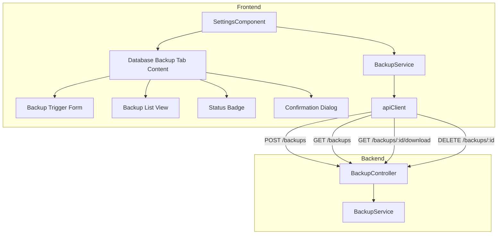
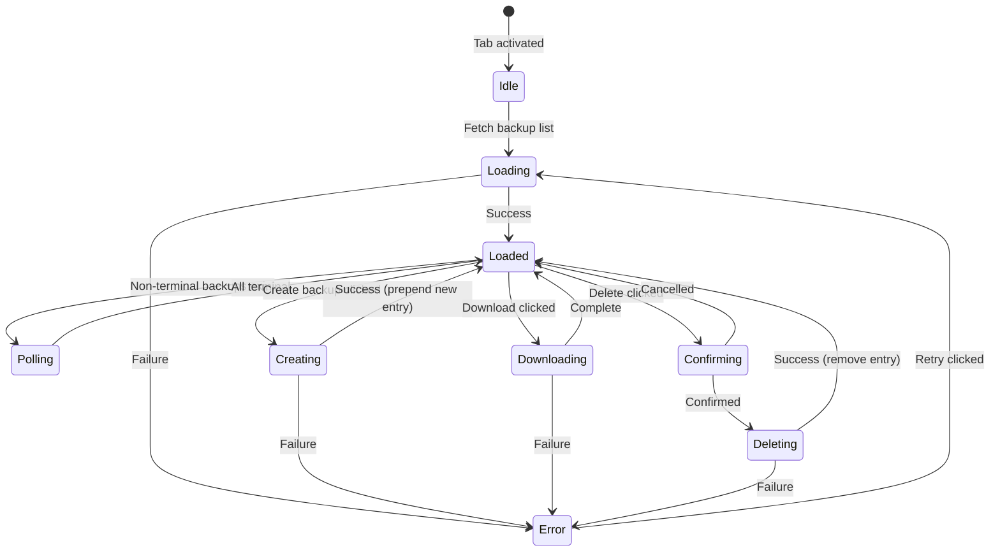

# Design Document: Database Backup Settings UI

## Overview

This feature adds a "Database Backup" tab to the existing Settings page in the STS Car Expert Angular frontend. The tab provides administrators with a complete backup management interface: triggering new backups, viewing backup history with real-time status polling, downloading completed backups, and deleting old backups.

The design integrates with the existing backend BackupModule REST API (`/backups` endpoints) and follows the established patterns in the Settings component — tab-based navigation, RBAC gating, shared `apiClient` for HTTP calls, and Tailwind CSS styling with dark mode support.

### Key Design Decisions

1. **In-component tab extension** — The new tab is added directly to the existing `SettingsComponent` tab array and content area, matching the current pattern (no child routing).
2. **Dedicated Angular service** — A new `BackupService` follows the same pattern as `BusinessSettingsService`: injectable, uses `apiClient`, returns typed async responses.
3. **Polling via `setInterval`** — Simple interval-based polling (5s) when non-terminal backups exist, cleared when all are terminal or the tab is deactivated.
4. **Pure utility functions** — Date formatting, file size formatting, and filename extraction are implemented as pure functions for testability.
5. **Role-based visibility** — Tab visibility uses `RbacService.isAdminOrSuperAdmin()` which already checks for "admin" or "superadmin" role names.

## Architecture



The architecture is intentionally flat — all backup UI lives within the existing `SettingsComponent` as a new tab section. No new routes or child components are introduced. This keeps the implementation consistent with how "System", "Print Settings", and "RBAC Configs" tabs are structured.

## Components and Interfaces

### SettingsComponent Extensions

The existing `SettingsComponent` is extended with:

```typescript
// Tab type extension
type SettingsTab = 'system' | 'print-settings' | 'rbac-configs' | 'database-backup';

// New tab entry in the tabs array
{ key: 'database-backup', label: 'Database Backup' }

// New state properties
backups: BackupMetadata[] = [];
isLoadingBackups = false;
isCreatingBackup = false;
downloadingIds: Set<string> = new Set();
deletingIds: Set<string> = new Set();
backupError = '';
backupMessage = '';
backupMessageTimeout: ReturnType<typeof setTimeout> | null = null;
pollingInterval: ReturnType<typeof setInterval> | null = null;

// Backup form
backupForm: { type: BackupType; format: BackupFormat } = { type: 'full', format: 'plain' };

// Confirmation dialog state
showDeleteConfirm = false;
deleteTargetId: string | null = null;
```

### BackupService (Frontend)

```typescript
// Path: frontend/src/app/shared/services/backup.service.ts

@Injectable({ providedIn: 'root' })
export class BackupService {
  async listBackups(): Promise<BackupMetadata[]>;
  async createBackup(params: CreateBackupParams): Promise<CreateBackupResponse>;
  async downloadBackup(id: string): Promise<Blob>;
  async deleteBackup(id: string): Promise<DeleteBackupResponse>;
}
```

### Interfaces

```typescript
// Shared frontend interfaces
interface BackupMetadata {
  id: string;
  status: 'pending' | 'in_progress' | 'completed' | 'failed';
  type: 'full' | 'schema-only' | 'data-only';
  format: 'plain' | 'custom';
  databaseName: string;
  createdAt: string;
  completedAt?: string;
  fileSizeBytes?: number;
  fileName?: string;
  errorMessage?: string;
  downloadUrl?: string;
}

type BackupType = 'full' | 'schema-only' | 'data-only';
type BackupFormat = 'plain' | 'custom';

interface CreateBackupParams {
  type: BackupType;
  format: BackupFormat;
}

interface CreateBackupResponse {
  id: string;
  status: string;
}

interface DeleteBackupResponse {
  id: string;
  status: 'deleted';
}
```

### Utility Functions

```typescript
// Path: frontend/src/app/shared/utils/backup-utils.ts

/** Formats an ISO 8601 timestamp to human-readable local date/time */
function formatBackupDate(isoString: string): string;

/** Formats bytes to human-readable file size (e.g., "2.5 MB") */
function formatFileSize(bytes: number): string;

/** Extracts filename from Content-Disposition header */
function extractFilename(contentDisposition: string | null): string | null;

/** Determines if polling should be active based on backup list */
function shouldPoll(backups: BackupMetadata[]): boolean;

/** Returns CSS classes for a status badge */
function getStatusBadgeClasses(status: BackupMetadata['status']): string;

/** Returns aria-label text for a status badge */
function getStatusAriaLabel(status: BackupMetadata['status']): string;
```

## Data Models

### State Flow



### Backup Type/Format Mapping

| UI Label | API Value |
|----------|-----------|
| Full | `full` |
| Schema Only | `schema-only` |
| Data Only | `data-only` |
| Plain SQL (.sql) | `plain` |
| Custom Archive (.dump) | `custom` |

### Polling Logic

- **Start polling**: When `backups.some(b => b.status === 'pending' || b.status === 'in_progress')`
- **Stop polling**: When all backups have status `'completed'` or `'failed'`, or when the tab is deactivated
- **Interval**: 5000ms
- **Mechanism**: `setInterval` calling `listBackups()`, cleared on tab switch or component destroy

## Correctness Properties

*A property is a characteristic or behavior that should hold true across all valid executions of a system — essentially, a formal statement about what the system should do. Properties serve as the bridge between human-readable specifications and machine-verifiable correctness guarantees.*

### Property 1: Backup creation payload correctness

*For any* valid combination of backup type (full, schema-only, data-only) and format (plain, custom) selected in the UI, the `BackupService.createBackup()` method SHALL produce a POST request body with the exact corresponding API values.

**Validates: Requirements 2.3**

### Property 2: Date formatting produces valid human-readable output

*For any* valid ISO 8601 timestamp string, the `formatBackupDate()` function SHALL produce a non-empty string that contains the month abbreviation, day number, year, and time components in a locale-appropriate format.

**Validates: Requirements 3.3**

### Property 3: File size formatting uses correct units and precision

*For any* non-negative integer representing bytes: if the value is less than 1024, the output SHALL be in bytes with no decimal; if 1024 or above, the output SHALL use the largest appropriate unit (KB, MB, GB) with exactly one decimal place.

**Validates: Requirements 3.4**

### Property 4: Polling is active if and only if non-terminal backups exist

*For any* list of `BackupMetadata` objects, `shouldPoll(backups)` SHALL return `true` if and only if at least one backup has status `'pending'` or `'in_progress'`.

**Validates: Requirements 4.2, 4.3**

### Property 5: Download button enabled if and only if status is completed

*For any* backup entry, the download action button SHALL be enabled if and only if `backup.status === 'completed'`.

**Validates: Requirements 5.1, 5.6**

### Property 6: Filename extraction from Content-Disposition header

*For any* valid Content-Disposition header string containing a `filename="..."` directive, the `extractFilename()` function SHALL return the filename value without surrounding quotes.

**Validates: Requirements 5.3**

### Property 7: Single feedback message invariant

*For any* sequence of backup operations that produce feedback messages, the component SHALL display exactly one message (either success or error) at any point in time, with the most recent operation's message replacing any previous one.

**Validates: Requirements 7.5**

### Property 8: Status badge aria-label correctness

*For any* valid backup status value, the `getStatusAriaLabel()` function SHALL return a string in the format `"Status: {Human Readable Status}"` where the status text uses title case with spaces (e.g., "In Progress" for "in_progress").

**Validates: Requirements 8.4**

## Error Handling

### Error Categories and Responses

| Error Source | HTTP Status | User-Facing Message | Recovery Action |
|---|---|---|---|
| Network failure | N/A (no response) | "Network error. Please check your connection and try again." | Retry button |
| Unauthorized | 401 | Handled transparently by apiClient interceptor | Auto token refresh |
| Forbidden | 403 | "You do not have permission to perform this action." | None (inform user) |
| Backup not found | 404 | "Backup not found. It may have been deleted." | Refresh list |
| Backup active (delete) | 409 | "Cannot delete backup while it is in progress." | Wait for completion |
| Backup not ready (download) | 409 | "Backup is not ready for download." | Wait for completion |
| Server error | 500 | "An unexpected error occurred. Please try again later." | Retry button |

### Error Handling Strategy

1. **Error extraction**: Use `axios.isAxiosError()` to extract server-provided error messages, falling back to generic messages.
2. **Single message display**: `backupError` and `backupMessage` are mutually exclusive — setting one clears the other.
3. **Auto-dismiss success**: Success messages auto-dismiss after 5 seconds via `setTimeout`, with the timeout cleared if a new message arrives.
4. **Per-entry loading states**: Download and delete operations track loading state per backup ID (using `Set<string>`) to allow independent operations on different entries.
5. **Polling resilience**: If a poll request fails, the error is silently ignored (no UI disruption) and polling continues on the next interval.

## Testing Strategy

### Unit Tests (Example-Based)

- **Tab visibility**: Verify tab renders for admin/superadmin, hidden for other roles
- **Tab activation**: Verify clicking tab shows backup content and triggers list fetch
- **Form rendering**: Verify dropdowns have correct options with correct defaults
- **Create flow**: Verify button states, API call, list prepend on success, error display on failure
- **List rendering**: Verify table columns, loading state, empty state, error state with retry
- **Status badge styles**: Verify correct CSS classes for each status value
- **Download flow**: Verify button states, API call with blob response, error handling for 404/409
- **Delete flow**: Verify confirmation dialog, API call, list removal, error handling for 404/409
- **Polling lifecycle**: Verify polling starts/stops correctly, cleans up on tab switch
- **Accessibility**: Verify aria-labels on buttons, status badges, and focus management in dialog
- **Responsive layout**: Verify correct CSS classes for desktop/mobile breakpoints

### Property-Based Tests

Property-based testing is appropriate for the pure utility functions in this feature. The following properties should be tested with a minimum of 100 iterations each using a PBT library (e.g., `fast-check`):

| Property | Function Under Test | Generator Strategy |
|---|---|---|
| Property 1 | `createBackup` payload mapping | All combinations of BackupType × BackupFormat |
| Property 2 | `formatBackupDate` | Random valid ISO 8601 timestamps |
| Property 3 | `formatFileSize` | Random non-negative integers (0 to 10^12) |
| Property 4 | `shouldPoll` | Random arrays of BackupMetadata with random statuses |
| Property 5 | Download button enabled state | Random BackupMetadata with random status |
| Property 6 | `extractFilename` | Random strings with valid Content-Disposition format |
| Property 7 | Message state management | Random sequences of success/error operations |
| Property 8 | `getStatusAriaLabel` | All valid status values |

**Configuration:**
- Library: `fast-check`
- Minimum iterations: 100 per property
- Tag format: `Feature: database-backup-settings-ui, Property {N}: {description}`

### Integration Tests

- End-to-end flow: Create backup → poll until completed → download → delete
- Verify apiClient interceptor handles 401 transparently during backup operations
- Verify polling stops when navigating away from the settings page
